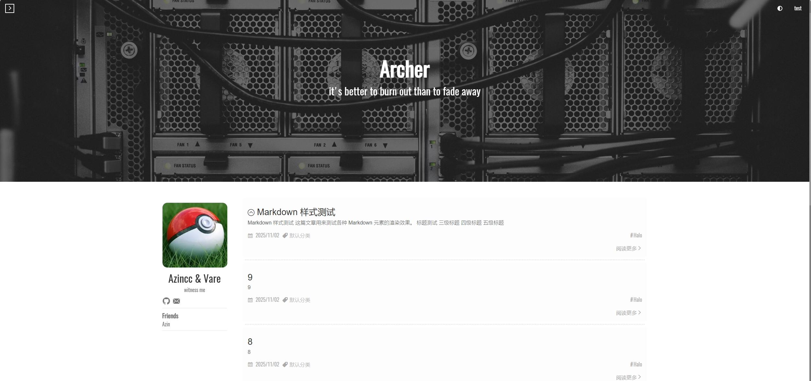

# Halo-theme-archer

本项目源于[hexo-theme-archer](https://github.com/fi3ework/hexo-theme-archer)

保留原项目样式，使用halo特性实现功能

📖 **[用户手册](docs/USER_GUIDE.md)** - 查看完整的主题配置指南

## 主题特色

- **深色/浅色模式** - 支持跟随系统、深色、浅色三种配色方案
- **自定义强调色** - 可分别设置浅色和深色主题的强调色
- **自定义页面顶图** - 支持首页、标签页、分类页、文章页、关于页、404 页单独配置顶部图片
- **浮动按钮主题** - 默认或圆形样式
- **阅读进度条** - 可自定义颜色风格
- **文章横幅主题** - 默认或简洁风格
- **头像边框显示** - 可选开关
- **个人资料固定** - 可选择是否固定侧边栏

### 个人资料

- 自定义头像、作者名、个性签名
- **社交链接** - 支持多个社交平台
- **友情链接** - 支持添加多个友链
- **附加个人链接** - 可自定义额外的链接入口

### 文章功能

- **文章目录 (TOC)** - 可选开启
- **字数统计与阅读时间** - 可选显示
- **摘要截断** - 可配置截断长度
- **阅读更多按钮** - 可选显示
- **文章分类显示** - 可选开关
- **文章时效性提示** - 可设置过期提示天数阈值

### 赞赏功能

- 支持开启赞赏模块
- 可添加多个二维码图片
- 自定义赞赏标题和描述

## 如果你喜欢这个项目

点🌟关注我们

推`pr`作出贡献

提`issue`提出问题

## 如何启动

源代码整体打包 上传至halo主题页面

## 推荐插件

[Shiki 代码高亮](https://www.halo.run/store/apps/app-kzloktzn)

## 已知问题

- [x] 搜索功能无法使用 计划使用halo的搜索功能
- [x] 黑夜模式下表格中的文字不变色
- [ ] 主页个人资料页面自定义图标方案未确定
- [ ] 站点访问人数统计仅支持pv
- [x] tag和category大小不一
- [x] Mermaid&Mathjax暂时不可用
- [x] 遗留的favicon 站点名称设置 未去除
- [x] 代码注入(扩展设置)功能未去除
- [x] 关于页面、404页面未实现 (v0.1.5)
- [x] 圆形浮动按钮未优化
- [ ] 文章页横幅主题未实现
- [x] 显示头像边框未实现 (avatar_border 配置)
- [x] 启用文章目录开关未生效 (theme.config.style.toc)
- [x] 统计和页脚重复设置项 (已检查无重复)
- [x] 使用文档未完成 (docs/USER_GUIDE.md)
- [x] about 和 friends跳转未实现 (v0.1.5 添加 About 链接到 profile)
- [ ] intro图片给默认动画未实现

## 未来规划

2026.1 搜索功能完善
2026.1 个人资料页面自定义图标功能完善
