# Archer 主题用户指南

本指南将帮助您了解 Archer 主题的所有功能配置。在 Halo 后台进入 **外观 → 主题 → Archer → 设置** 即可访问这些配置项。

---

## 目录

- [基础设置](#基础设置)
- [个人资料](#个人资料)
- [风格设置](#风格设置)
- [社交媒体](#社交媒体)
- [赞赏设置](#赞赏设置)
- [分析统计](#分析统计)
- [页脚设置](#页脚设置)
- [其他设置](#其他设置)
- [文章级别设置](#文章级别设置)

---

## 基础设置

基础设置用于配置网站的核心信息。

| 配置项 | 说明                           | 默认值                                    |
| ------ | ------------------------------ | ----------------------------------------- |
| 主标题 | 网站的主标题，显示在侧边栏顶部 | Archer's Blog                             |
| 副标题 | 网站副标题，显示在主标题下方   | it's better to burn out than to fade away |


---

## 个人资料

个人资料设置用于展示博主信息。

### 基本信息

| 配置项   | 说明                   | 默认值             |
| -------- | ---------------------- | ------------------ |
| 头像     | 博主头像图片           | /avatar/Misaka.jpg |
| 作者名   | 博主名称               | Azincc             |
| 个性签名 | 显示在作者名下方的签名 | witness me         |

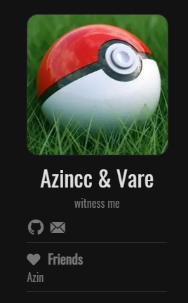

### 社交链接

添加您的社交媒体链接，将显示在侧边栏个人资料区域。

| 字段 | 说明                  | 示例                  |
| ---- | --------------------- | --------------------- |
| 名称 | 社交平台名称          | github                |
| 链接 | 社交平台 URL          | //github.com/username |
| 图标 | Font Awesome 图标类名 | fab fa-github         |

**常用图标参考**：

| 平台      | 图标类名          |
| --------- | ----------------- |
| GitHub    | `fab fa-github`   |
| Twitter/X | `fab fa-twitter`  |
| 微博      | `fab fa-weibo`    |
| 邮箱      | `fas fa-envelope` |
| 微信      | `fab fa-weixin`   |
| QQ        | `fab fa-qq`       |
| Telegram  | `fab fa-telegram` |
| Discord   | `fab fa-discord`  |

> 更多图标请参考 [Font Awesome 图标库](https://fontawesome.com/v5/search)

<!-- 社交链接配置包含在个人资料示例中 -->

### 友情链接

添加友情链接，显示在侧边栏。

| 字段 | 说明     | 必填 |
| ---- | -------- | ---- |
| 名称 | 友链名称 | 是   |
| 链接 | 友链 URL | 是   |

<!-- 友情链接配置包含在个人资料示例中 -->

### 个人资料图标

自定义侧边栏底部的功能图标。

| 配置项   | 说明               | 默认值         |
| -------- | ------------------ | -------------- |
| 启用     | 是否启用自定义图标 | 关闭           |
| 友链图标 | 友链入口图标       | fas fa-heart   |
| 关于图标 | 关于页面入口图标   | fas fa-id-card |
| 搜索图标 | 搜索入口图标       | fas fa-search  |

### 附加个人链接

添加额外的自定义链接入口。

| 字段 | 说明                  |
| ---- | --------------------- |
| 名称 | 链接名称              |
| 链接 | 链接 URL              |
| 图标 | Font Awesome 图标类名 |

---

## 风格设置

风格设置用于自定义主题的视觉效果。

### 配色方案

| 配置项         | 说明               | 选项                   |
| -------------- | ------------------ | ---------------------- |
| 默认配色       | 网站默认的颜色模式 | 跟随系统 / 深色 / 浅色 |
| 浅色主题强调色 | 浅色模式下的主题色 | #f75357                |
| 深色主题强调色 | 深色模式下的主题色 | #f75357                |

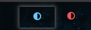

### 页面顶图

为不同页面设置顶部横幅图片。

| 配置项         | 说明              |
| -------------- | ----------------- |
| 首页顶部图片   | 首页 Banner 图片  |
| 标签页顶部图片 | 标签列表页 Banner |
| 分类页顶部图片 | 分类列表页 Banner |
| 文章页顶部图片 | 文章详情页 Banner |
| 关于页顶部图片 | 关于页面 Banner   |
| 404页顶部图片  | 404 错误页 Banner |

> 建议使用宽度 1920px 以上的图片以获得最佳效果

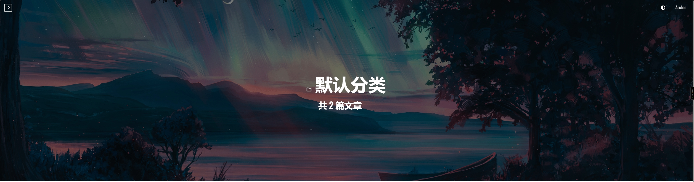

### 简介高度

调整各页面顶部简介区域的高度（单位：vh，即视窗高度百分比）。

| 配置项         | 说明               | 默认值 |
| -------------- | ------------------ | ------ |
| 首页简介高度   | 首页顶部区域高度   | 50     |
| 文章页简介高度 | 文章页顶部区域高度 | 50     |
| 关于页简介高度 | 关于页顶部区域高度 | 50     |

### 界面组件

| 配置项         | 说明               | 选项/默认值 |
| -------------- | ------------------ | ----------- |
| 浮动按钮主题   | 右下角浮动按钮样式 | 默认 / 圆形 |
| 阅读进度条颜色 | 文章阅读进度条样式 | 默认 / 特色 |
| 文章页横幅主题 | 文章页顶部样式     | 默认 / 简洁 |
| 显示头像边框   | 头像是否显示边框   | 开启        |
| 固定个人资料   | 侧边栏是否固定     | 关闭        |

**浮动按钮样式对比：**

|              默认样式              |              圆形样式              |
| :--------------------------------: | :--------------------------------: |
| 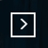 |  |

### 文章列表

| 配置项             | 说明                     | 默认值 |
| ------------------ | ------------------------ | ------ |
| 显示文章分类       | 列表是否显示文章分类     | 关闭   |
| 启用富文本摘要     | 是否在列表显示富文本摘要 | 关闭   |
| 显示阅读更多按钮   | 是否显示"阅读更多"按钮   | 关闭   |
| 启用文章目录       | 文章页是否显示 TOC 目录  | 开启   |
| 显示字数和阅读时间 | 是否显示文章字数统计     | 关闭   |

**文章列表功能效果展示：**

|      功能      |                    效果                    |
| :------------: | :----------------------------------------: |
|   富文本摘要   |   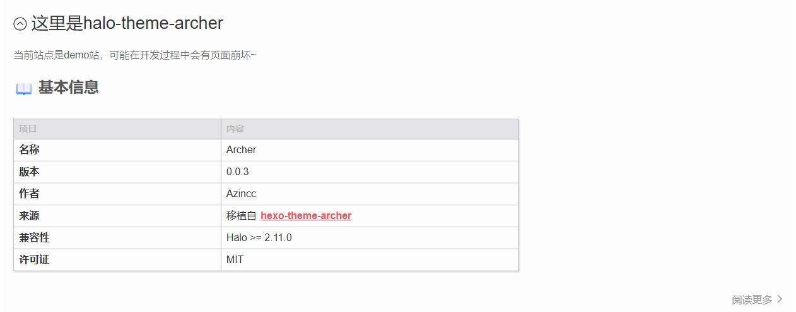   |
|  阅读更多按钮  | 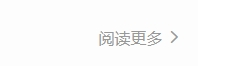 |
| 文章目录 (TOC) | 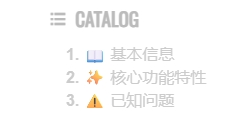 |
| 字数和阅读时间 | 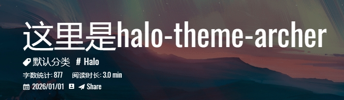 |

---

## 社交媒体

配置社交媒体分享相关的元信息。

| 配置项             | 说明                     |
| ------------------ | ------------------------ |
| Twitter ID         | Twitter 用户名（不含 @） |
| Facebook 管理员 ID | Facebook 管理员 ID       |
| Facebook App ID    | Facebook 应用 ID         |

> 这些配置用于优化文章在社交媒体上的分享效果

---

## 赞赏设置

开启赞赏功能，让读者可以打赏支持您。

| 配置项 | 说明                   | 默认值                     |
| ------ | ---------------------- | -------------------------- |
| 启用   | 是否开启赞赏功能       | 关闭                       |
| 标题   | 赞赏弹窗标题           | Buy Me A Coffee            |
| 描述   | 赞赏说明文字           | If this post helped you... |
| 二维码 | 添加多个收款二维码图片 | -                          |

### 配置步骤

1. 勾选 **启用** 开启赞赏功能
2. 设置赞赏 **标题** 和 **描述**
3. 点击 **添加二维码** 上传收款码图片（支持多个）


---

## 分析统计

配置网站访问统计服务。

### 第三方统计

| 配置项       | 说明                     |
| ------------ | ------------------------ |
| 百度统计 ID  | 百度统计的站点 ID        |
| 谷歌统计 ID  | Google Analytics 跟踪 ID |
| CNZZ 统计 ID | CNZZ 站点统计 ID         |

### 访问统计

使用 Halo 内置的站点统计功能显示访问量。

| 配置项   | 说明                   | 默认值                 |
| -------- | ---------------------- | ---------------------- |
| 启用     | 是否在页脚显示访问统计 | 开启                   |
| 显示文本 | 统计显示格式           | 本站访客数${count}人次 |

> 使用 `${count}` 作为占位符显示统计数字，数据来源于 Halo 内置统计

<!-- 访问统计效果见页脚部分截图 -->

---

## 页脚设置

配置网站底部信息。

### 备案信息

| 配置项       | 说明           | 默认值 |
| ------------ | -------------- | ------ |
| 启用备案信息 | 是否显示备案号 | 关闭   |
| 备案号       | ICP 备案号     | -      |

### 自定义底部信息

添加额外的底部链接或信息。

| 字段     | 说明           |
| -------- | -------------- |
| 信息文本 | 显示的文字     |
| 信息链接 | 点击跳转的链接 |
| 图标     | 图标图片       |

### 其他

| 配置项       | 说明                 | 默认值 |
| ------------ | -------------------- | ------ |
| 显示统计信息 | 底部是否显示全站统计 | 开启   |


---

## 其他设置

### 版权信息

| 配置项       | 说明                     | 默认值       |
| ------------ | ------------------------ | ------------ |
| 启用版权信息 | 文章底部是否显示版权声明 | 开启         |
| 许可协议     | 版权协议 HTML 内容       | CC BY-NC 4.0 |

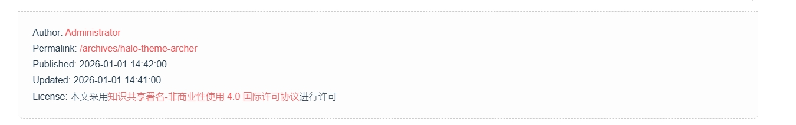

### 文章时效性提示

对于较旧的文章显示过期提醒。

| 配置项         | 说明                 | 默认值 |
| -------------- | -------------------- | ------ |
| 启用           | 是否开启时效性提示   | 关闭   |
| 阈值天数       | 超过多少天显示提示   | 180    |
| 为指定文章启用 | 是否只对特定文章生效 | 关闭   |

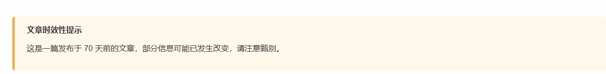

### Mermaid 图表

支持在文章中使用 Mermaid 语法绘制流程图、时序图等。

| 配置项 | 说明                  | 默认值   |
| ------ | --------------------- | -------- |
| 启用   | 是否开启 Mermaid 支持 | 关闭     |
| 主题   | 图表配色主题          | 跟随系统 |

**主题选项**：

| 选项     | 说明                  |
| -------- | --------------------- |
| 跟随系统 | 自动匹配深色/浅色模式 |
| 默认     | Mermaid 默认主题      |
| 深色     | 深色背景主题          |
| 森林     | 绿色调主题            |
| 中性     | 灰色调主题            |

**使用示例**：

````markdown
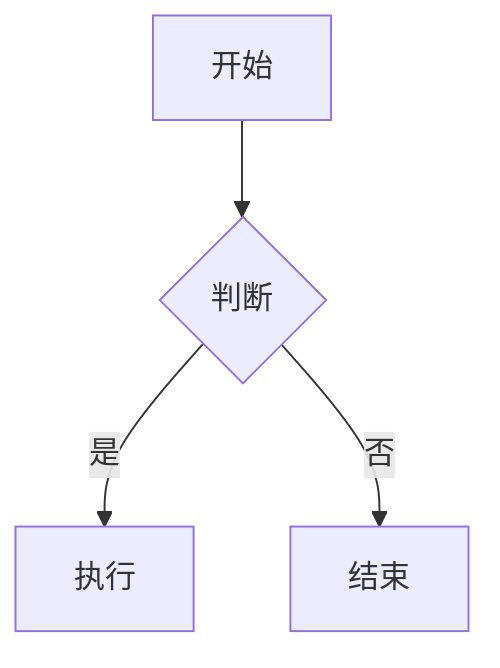
````

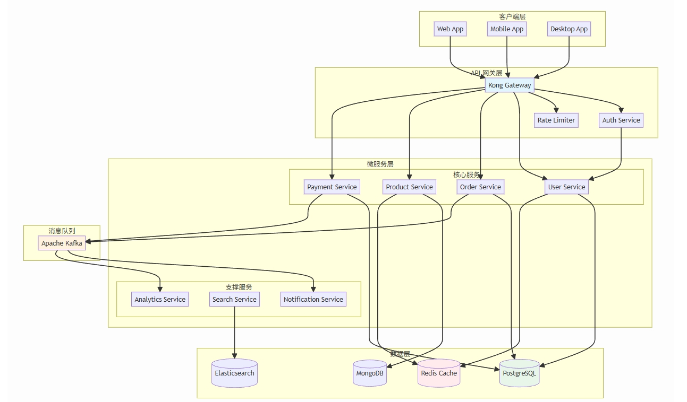

### LaTeX 数学公式

支持在文章中使用 LaTeX 语法渲染数学公式。

| 配置项       | 说明                 | 默认值 |
| ------------ | -------------------- | ------ |
| 启用 MathJax | 是否开启数学公式支持 | 关闭   |

**使用示例**：

```markdown
行内公式：$E = mc^2$

块级公式：

$$
\frac{n!}{k!(n-k)!} = \binom{n}{k}
$$
```

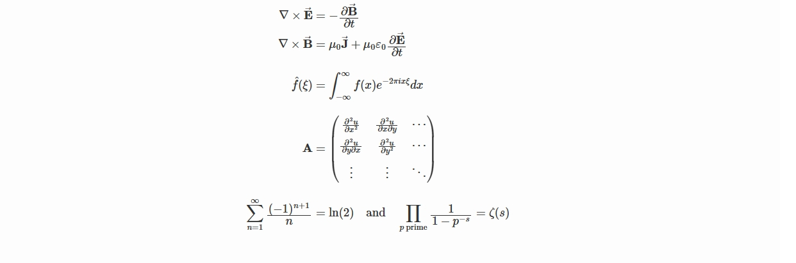

### 自定义字体

使用自定义 Web 字体。

| 配置项       | 说明               | 默认值                   |
| ------------ | ------------------ | ------------------------ |
| 启用         | 是否使用自定义字体 | 关闭                     |
| 字体名称     | 字体名称和字重     | Noto Sans SC:n3,n4,n5,n7 |
| 字体 CDN URL | 字体 CSS 文件地址  | Google Fonts 链接        |

---

## 文章级别设置

除了全局设置，您还可以为单篇文章配置特定选项。在文章编辑页面的 **元数据** 中可以找到这些设置。

### 富文本摘要截取行数

| 配置项             | 说明                                   |
| ------------------ | -------------------------------------- |
| 富文本摘要截取行数 | 覆盖全局设置的摘要行数，留空使用默认值 |

> 设置为 `0` 时将显示系统默认摘要

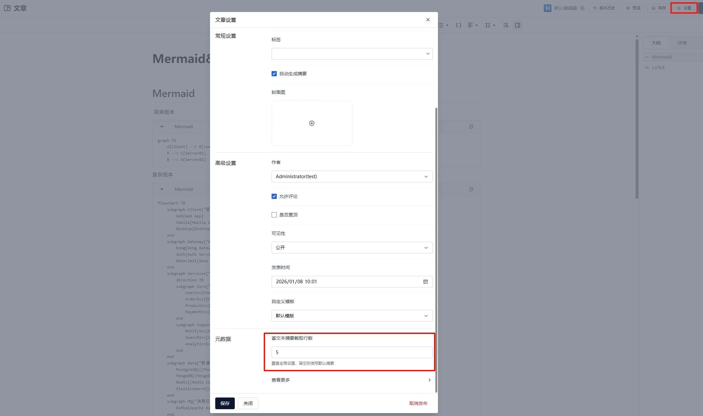

---

## 推荐插件

为获得最佳体验，建议安装以下 Halo 插件：

| 插件                                                           | 说明                       |
| -------------------------------------------------------------- | -------------------------- |
| [Shiki 代码高亮](https://www.halo.run/store/apps/app-kzloktzn) | 提供更好的代码语法高亮效果 |

---

## 常见问题

### Q: 如何修改网站 Logo？

A: 网站 Logo 在 Halo 后台的 **系统设置 → 基本设置** 中配置，不在主题设置内。

### Q: 社交图标不显示？

A: 请确保填写正确的 Font Awesome 5 图标类名，格式为 `fab fa-xxx` 或 `fas fa-xxx`。

### Q: 如何添加自定义 CSS？

A: 可以在 Halo 后台的 **设置 → 代码注入** 中添加自定义样式。

### Q: 深色模式下某些元素颜色不对？

A: 请确认是否使用了最新版本的主题，如问题持续存在请提交 Issue。

---

## 获取帮助

- 📖 [项目主页](https://github.com/Azincc/halo-theme-archer)
- 🐛 [提交 Issue](https://github.com/Azincc/halo-theme-archer/issues)
- 💬 [参与讨论](https://github.com/Azincc/halo-theme-archer/discussions)
